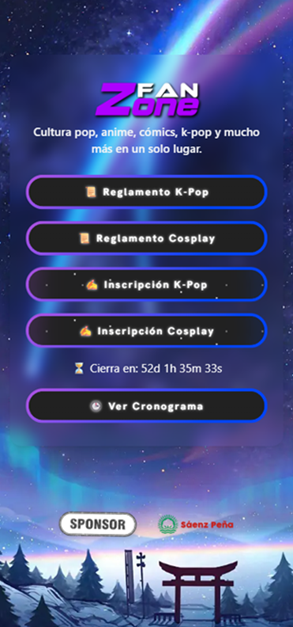

# 🎌 Landing Page de Eventos Anime

Bienvenido/a a **Eventos Frik**, una landing page moderna y responsiva diseñada para promocionar eventos de anime, cosplay, manga y cultura geek.

## 🔗 Enlace en vivo

👉 [Ver Landing Page](https://alexiasxro.github.io/EventosFrik/)
🌐 [Netlify Pages](https://faneventos.netlify.app/)

## 🧰 Tecnologías utilizadas

- ⚙️ HTML5
- 🎨 CSS3  
- 💨 [Tailwind CSS](https://tailwindcss.com/)  
- 🧠 JavaScript 
- 🌐 GitHub Pages (para hosting)
- 🌐 Netlify Pages (para hosting del cliente)

## 💡 Posibles mejoras

- Agregar sección de contacto
- Integración con Google Maps para ubicación del evento
- Agendar evento con Google Calendar
- Formulario de inscripción con validación
- Accesibilidad mejorada

## 👩‍💻 Autor/a

Desarrollado por [@alexiasxro](https://github.com/alexiasxro)  
📅 Proyecto para eventos y ferias frikis en Argentina.

## 🖼️ Captura 

